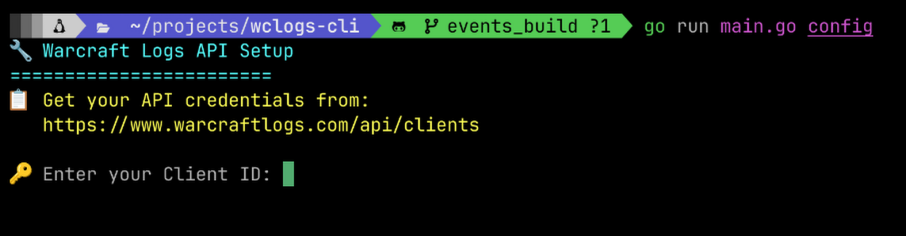
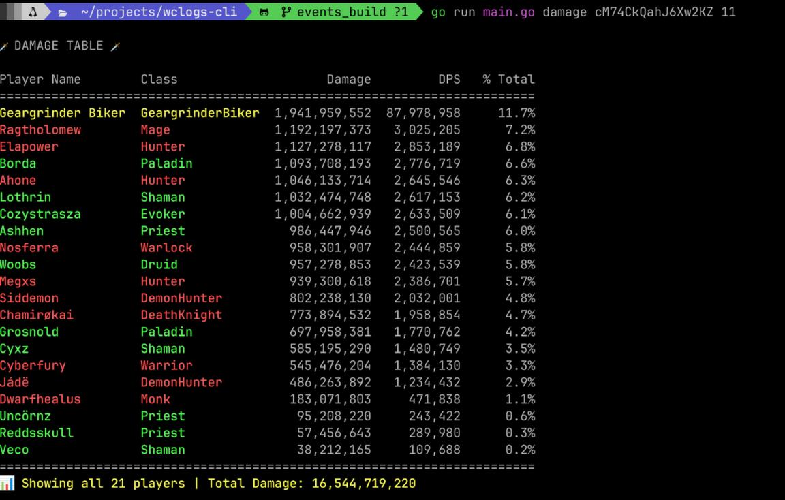

# Warcraft Logs CLI - GraphQL Learning Project

**A deep dive into complex API integration, GraphQL querying, and OAuth2 authentication.**

I built this CLI tool to learn GraphQL by tackling a real-world challenge: the Warcraft Logs API. This project represents my journey from "What is GraphQL?" to implementing OAuth2 flows, complex nested queries, and terminal-based data visualization. While not feature-complete, it demonstrates practical API integration skills and the ability to learn complex technologies by building real tools.

## Visual Examples

### Configuration


### Damage Table


### Healing Table


### Death Analysis


## What This Project Demonstrates

**Successfully Implemented:**
- ✅ **OAuth2 Authentication** - Full token management and refresh flow
- ✅ **Complex GraphQL Queries** - Nested queries for damage, healing, deaths, and interrupts
- ✅ **Professional Terminal UI** - Clean tables with formatted output
- ✅ **Advanced Data Analysis** - Death timelines with 5-second damage breakdown
- ✅ **Smart Caching** - Efficient ability name lookups
- ✅ **Player Filtering** - Case-insensitive search across reports
- ✅ **Data Export** - CSV and JSON formats

**What I Learned Along the Way:**
- GraphQL is fundamentally different from REST (and WCL's implementation is particularly complex)
- Professional API development tools exist beyond curl (discovered Postman during research)
- OAuth2 token lifecycle management and refresh patterns
- Parsing deeply nested JSON structures in Go
- Correlating complex game events across multiple API responses

**Known Limitations (Learning Opportunities):**
- Specialization detection not implemented (Holy vs Ret Paladin, etc.)
- Some spell details in death analysis need refinement
- Interrupt correlation accuracy could be improved
- Individual player ability analysis is incomplete

These limitations reflect where I was in my learning journey, not the ceiling of what I can do. With what I know now about GraphQL and the WCL API structure, I'd approach these challenges differently.

## Technical Architecture
```
User Input
    ↓
[CLI (Cobra)] → [OAuth2 Manager] → [GraphQL Query Builder]
                                          ↓
                                    [WCL API]
                                          ↓
                                    [JSON Parser] → [Data Transformer]
                                                          ↓
                                                    [Terminal Display]
```

**Key Technologies:**
- **Go** - Primary language for performance and CLI tools
- **Cobra** - Professional CLI framework
- **GraphQL** - Complex nested queries to WCL API
- **OAuth2** - Authentication and token management
- **JSON** - Advanced parsing of nested data structures

## Quick Start
```bash
# Clone and setup
git clone
cd wclogs-cli
go mod tidy

# Get API credentials at https://www.warcraftlogs.com/api/clients
go run main.go config

# Run commands
go run main.go damage 6qNJmgYBTcyfvpWF 3
go run main.go healing 6qNJmgYBTcyfvpWF 3 --top 5
go run main.go deaths 6qNJmgYBTcyfvpWF 3 --player "Tekkyysp"
go run main.go interrupts 6qNJmgYBTcyfvpWF 3
```

## Command Examples

**Damage Analysis:**
```bash
go run main.go damage 6qNJmgYBTcyfvpWF 3
# Displays damage done by all players in fight #3
```

**Healing with Filtering:**
```bash
go run main.go healing 6qNJmgYBTcyfvpWF 3 --top 5
# Shows top 5 healers with formatted table output
```

**Death Timeline Analysis:**
```bash
go run main.go deaths 6qNJmgYBTcyfvpWF 3 --player "Tekkyysp"
# Detailed 5-second damage breakdown leading to death
```

**Interrupt Tracking:**
```bash
go run main.go interrupts 6qNJmgYBTcyfvpWF 3 --player "PlayerName"
# Player-specific or full raid interrupt analysis
```

**Export Options:**
```bash
go run main.go damage 6qNJmgYBTcyfvpWF 3 --export csv
go run main.go healing 6qNJmgYBTcyfvpWF 3 --export json
```

## Code Highlights

### GraphQL Query Construction
```go
// Building complex nested queries for the WCL API
query := fmt.Sprintf(`{
  reportData {
    report(code: "%s") {
      events(fightIDs: [%d], dataType: DamageDone) {
        data
        nextPageTimestamp
      }
    }
  }
}`, reportCode, fightID)
```

### OAuth2 Token Management
```go
// Automatic token refresh when expired
func (c *Client) ensureValidToken() error {
    if time.Now().After(c.tokenExpiry) {
        return c.refreshToken()
    }
    return nil
}
```

### Death Timeline Analysis
```go
// Correlating damage events to create death timeline
// Shows what killed a player in the 5 seconds before death
func analyzeDamageBeforeDeath(events []Event, deathTime int) []DamageSource {
    // Event correlation logic here
}
```

## What I'd Do Differently Now

**If I restarted this project with my current knowledge:**

1. **Use Postman for API exploration** - Would have saved hours of curl debugging
2. **Build GraphQL queries incrementally** - Start simple, add complexity gradually
3. **Create type definitions first** - Define Go structs before writing queries
4. **Implement spec detection early** - Tackle the hard problem first, not last
5. **Write tests for JSON parsing** - Complex nested structures need test coverage

**These learnings transfer to any API integration project.**

## Why This Project Matters

This demonstrates several key skills employers value:

1. **Self-Directed Learning** - Took on GraphQL without prior experience
2. **Complex Problem Solving** - OAuth2, nested queries, event correlation
3. **Professional Tool Building** - CLI design, error handling, user experience
4. **Honest Assessment** - Can evaluate my own work and identify improvements
5. **Practical Application** - Built a real tool, not just tutorials

**Most importantly:** This shows I can learn complex technologies by building real projects, not just following tutorials.

## Future Enhancements

If continuing development:
- Implement specialization detection using character data queries
- Refine spell detail accuracy in death analysis
- Improve interrupt-to-cast event correlation
- Add ability usage analysis for individual players
- Create configuration profiles for different report types

## Tools & Technologies

- **Language:** Go 1.19+
- **CLI Framework:** Cobra
- **API:** Warcraft Logs GraphQL API
- **Auth:** OAuth2 with token refresh
- **Data Format:** JSON parsing and transformation
- **Output:** Terminal tables, CSV, JSON export

## Installation
```bash
# Prerequisites: Go 1.19+

# Clone repository
git clone
cd wclogs-cli

# Install dependencies
go mod tidy

# Get API credentials
# Visit: https://www.warcraftlogs.com/api/clients

# Configure
go run main.go config

# Run
go run main.go --help
```

## My Learning Journey

I started this project to learn CLI development in Go and chose Warcraft Logs as a challenging real-world API. Along the way, I discovered:

- **GraphQL is different** - Not just "REST with one endpoint"
- **APIs have personalities** - WCL's implementation taught me about API design choices
- **Professional tools exist** - Postman, GraphQL playgrounds, etc.
- **OAuth2 has nuance** - Token lifecycle, refresh flows, error handling
- **Data visualization matters** - Clean terminal output requires thought

This project pushed me beyond tutorials into real-world complexity. The incomplete features aren't failures—they're documented learning opportunities that show where I was then and how I'd approach them now.

## Contributing

This is a learning project, but suggestions and improvements are welcome. The codebase demonstrates practical GraphQL integration patterns that could benefit from community expertise.

## Acknowledgments

- Warcraft Logs for providing a complex, real-world GraphQL API to learn from
- The Go community for excellent documentation on CLI tools and HTTP clients

## License

MIT License - Feel free to learn from this code
