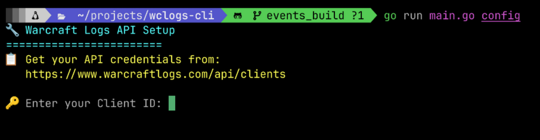
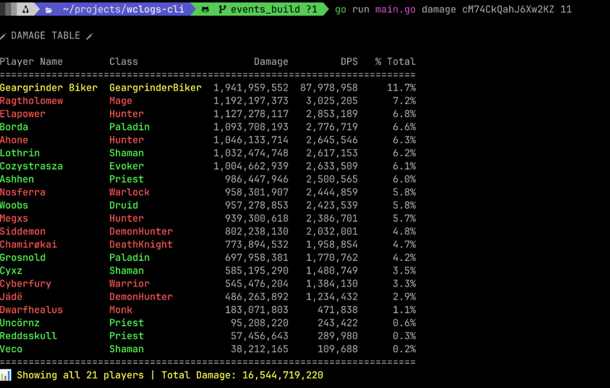
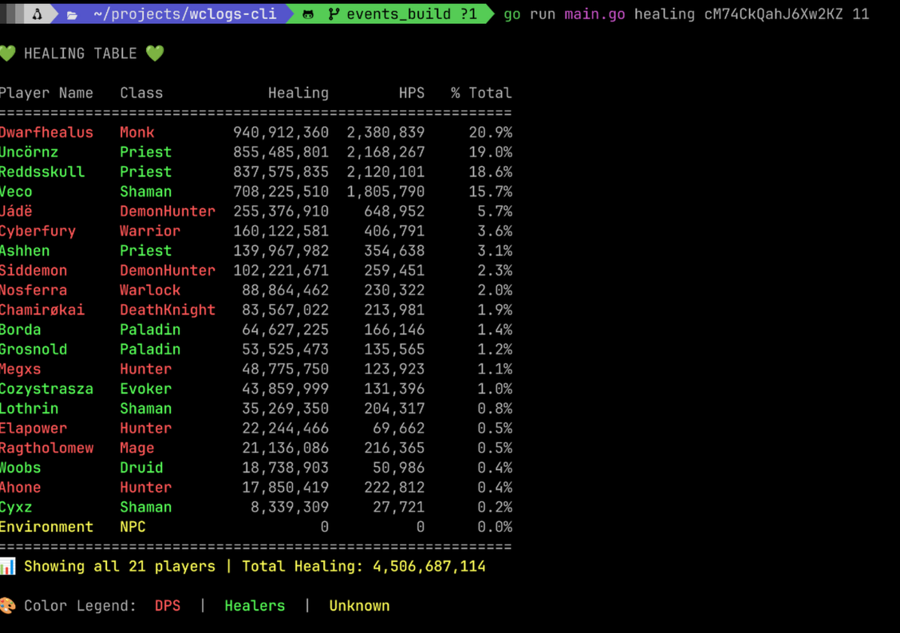
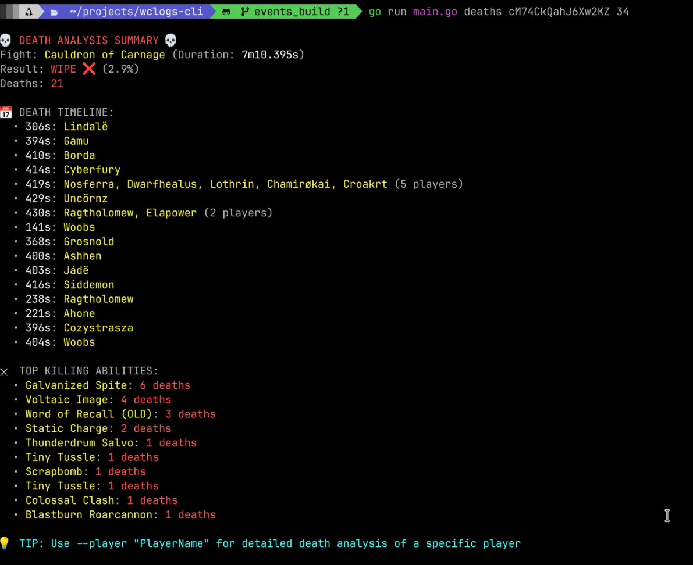

# Warcraft Logs CLI - GraphQL Learning Project

**A deep dive into complex API integration, GraphQL querying, and OAuth2 authentication.**

## 🚀 One-Line Installation

```bash
# Install directly from GitHub
go install github.com/Redsskull/wclogs-cli@latest

# Setup and start analyzing
wclogs config
wclogs damage ABC123 5
```

I built this CLI tool to learn GraphQL by tackling a real-world challenge: the Warcraft Logs API. This project represents my journey from "What is GraphQL?" to implementing OAuth2 flows, complex nested queries, terminal-based data visualization, and sophisticated event correlation. The breakthrough achievement was developing a professional-grade interrupt analysis system that matches Warcraft Logs' web interface functionality through discovery of hidden API fields and advanced event correlation techniques.

## Visual Examples

### Configuration


### Damage Table


### Healing Table


### Death Analysis


### Interrupt Analysis
*Professional WCL-style interrupt tracking with spell correlation and missed opportunity analysis*

## What This Project Demonstrates

**Successfully Implemented:**
- ✅ **OAuth2 Authentication** - Full token management and refresh flow
- ✅ **Complex GraphQL Queries** - Nested queries for damage, healing, deaths, and interrupts
- ✅ **"Last" Fight Resolution** - Matches WCL web interface behavior using official encounterID logic
- ✅ **Professional Terminal UI** - Clean tables with formatted output
- ✅ **WCL CSV-Compatible Death Analysis** - Perfect unified timeline matching WCL exports exactly
- ✅ **Professional Interrupt Analysis** - WCL-style interrupt tracking with spell correlation
- ✅ **Smart Caching** - Efficient ability name lookups
- ✅ **Player Management** - List all players with class/role filtering and search
- ✅ **Player Filtering** - Case-insensitive search across reports
- ✅ **Data Export** - CSV and JSON formats

**What I Learned Along the Way:**
- GraphQL is fundamentally different from REST (and WCL's implementation is particularly complex)
- Professional API development tools exist beyond curl (discovered Postman during research)
- OAuth2 token lifecycle management and refresh patterns
- Parsing deeply nested JSON structures in Go
- Correlating complex game events across multiple API responses
- **Breakthrough discovery**: WCL's `extraAbilityGameID` field enables perfect interrupt-to-spell correlation
- **WCL API insights**: `encounterID = 0` indicates trash fights; `fight=last` filters these out
- **Death Analysis breakthrough**: `sourceID` semantics for DamageTaken queries (player receiving damage)
- **Unified timeline implementation**: Hybrid Table API + Events API approach for perfect WCL CSV matching

**Known Limitations (Learning Opportunities):**
- Specialization detection not implemented (Holy vs Ret Paladin, etc.)
- Some spell details in death analysis need refinement
- Individual player ability analysis is incomplete

These limitations reflect where I was in my learning journey, not the ceiling of what I can do. With what I know now about GraphQL and the WCL API structure, I'd approach these challenges differently.

## Technical Architecture
```
User Input
    ↓
[CLI (Cobra)] → [OAuth2 Manager] → [GraphQL Query Builder]
                                          ↓
                                    [WCL API]
                                          ↓
                                    [JSON Parser] → [Data Transformer]
                                                          ↓
                                                    [Terminal Display]
```

**Key Technologies:**
- **Go** - Primary language for performance and CLI tools
- **Cobra** - Professional CLI framework
- **GraphQL** - Complex nested queries to WCL API
- **OAuth2** - Authentication and token management
- **JSON** - Advanced parsing of nested data structures

## Installation

### Option 1: Using Makefile (Recommended)
```bash
# Clone and setup
git clone https://github.com/Redsskull/wclogs-cli.git
cd wclogs-cli

# Complete setup (downloads deps, builds, shows next steps)
make setup

# Install globally
make install
# Now you can use 'wclogs' from anywhere
```

### Option 2: Go Install (Simplest)
```bash
# Install directly from GitHub (requires Go 1.19+)
go install github.com/Redsskull/wclogs-cli@latest
```

### Option 3: Manual Build
```bash
# Clone and build
git clone https://github.com/Redsskull/wclogs-cli.git
cd wclogs-cli
go mod tidy
go build -o wclogs

# Optional: Install globally (Unix/Linux/macOS)
sudo mv wclogs /usr/local/bin/
# Now you can use 'wclogs' from anywhere

# Or add to PATH manually
export PATH=$PATH:$(pwd)
```

### Option 4: Development Mode
```bash
# For development/testing only
git clone https://github.com/Redsskull/wclogs-cli.git
cd wclogs-cli
go mod tidy
go run main.go --help
```

### Option 5: Container (Optional)
```bash
# If you prefer containerized tools or lack Go runtime
git clone https://github.com/Redsskull/wclogs-cli.git
cd wclogs-cli

# Run without local Go installation
make container-run ARGS="config"
make container-run ARGS="damage ABC123 5"
```

## Quick Examples

**Native Installation:**
```bash
go install github.com/Redsskull/wclogs-cli@latest
wclogs config
wclogs damage 6qNJmgYBTcyfvpWF 3
wclogs damage 6qNJmgYBTcyfvpWF last    # Last meaningful boss encounter
wclogs healing 6qNJmgYBTcyfvpWF 3 --top 5
wclogs deaths 6qNJmgYBTcyfvpWF 3 --player "Tekkyysp"
wclogs interrupts YMRqjzC2WPnhwNJd 2
wclogs players 6qNJmgYBTcyfvpWF         # List all players in report
wclogs players 6qNJmgYBTcyfvpWF 5       # List players in fight 5
wclogs players 6qNJmgYBTcyfvpWF last    # List players in last fight
```

**Container Installation:**
```bash
git clone https://github.com/Redsskull/wclogs-cli.git && cd wclogs-cli
make container-run ARGS="config"
make container-run ARGS="damage 6qNJmgYBTcyfvpWF 3"
make container-run ARGS="damage 6qNJmgYBTcyfvpWF last"
make container-run ARGS="players 6qNJmgYBTcyfvpWF"
make container-run ARGS="players 6qNJmgYBTcyfvpWF 5"
make container-run ARGS="players 6qNJmgYBTcyfvpWF last"
```

## Command Examples

**Damage Analysis:**
```bash
wclogs damage 6qNJmgYBTcyfvpWF 3      # Specific fight number
wclogs damage 6qNJmgYBTcyfvpWF last   # Last meaningful boss encounter
# Uses WCL's official logic: filters out trash fights (encounterID = 0)
```

**Healing with Filtering:**
```bash
wclogs healing 6qNJmgYBTcyfvpWF 3 --top 5     # Specific fight
wclogs healing 6qNJmgYBTcyfvpWF last --top 5   # Last meaningful fight
# Shows top 5 healers with formatted table output
```

**Death Timeline Analysis (WCL CSV Compatible):**
```bash
wclogs deaths 6qNJmgYBTcyfvpWF 3 --player "Tekkyysp"
# Complete unified timeline matching WCL CSV exports exactly:
# • Individual damage/heal events with precise timestamps
# • HP progression tracking ("1.4m - 7.6%" format)  
# • Overkill information ("1,438,291 (O:1,340,696)")
# • Environmental damage attribution
```

**Professional Interrupt Analysis:**
```bash
wclogs interrupts YMRqjzC2WPnhwNJd 2
# Full WCL-style analysis with stopped vs missed breakdown

wclogs interrupts YMRqjzC2WPnhwNJd 2 --player "BlagZeras"
# Player-specific detailed interrupt performance

wclogs interrupts YMRqjzC2WPnhwNJd 2 --verbose
# Detailed analysis with API progress tracking
```

**Player Management:**
```bash
wclogs players 6qNJmgYBTcyfvpWF 5 --role "Tank"     # Tanks in fight 5
wclogs players 6qNJmgYBTcyfvpWF --class "Paladin"   # All Paladins in report
wclogs players 6qNJmgYBTcyfvpWF last --search "Pmpm" # Search in last fight
```

**Export Options:**
```bash
wclogs damage 6qNJmgYBTcyfvpWF 3 --output damage.csv
wclogs healing 6qNJmgYBTcyfvpWF 3 --output healing.json
wclogs players 6qNJmgYBTcyfvpWF 5 --output fight5_players.csv
```

## Code Highlights

### GraphQL Query Construction
```go
// Building complex nested queries for the WCL API
query := fmt.Sprintf(`{
  reportData {
    report(code: "%s") {
      events(fightIDs: [%d], dataType: DamageDone) {
        data
        nextPageTimestamp
      }
    }
  }
}`, reportCode, fightID)
```

### OAuth2 Token Management
```go
// Automatic token refresh when expired
func (c *Client) ensureValidToken() error {
    if time.Now().After(c.tokenExpiry) {
        return c.refreshToken()
    }
    return nil
}
```

### WCL CSV-Compatible Death Timeline
```go
// Unified timeline combining Table API + Events API for perfect WCL matching
func executeUnifiedDeathAnalysis(apiClient *api.Client, reportCode string, fightID, playerID int, deathTime float64) {
    // Step 1: Get complete damage breakdown (Table API)
    damageSources := getDamageTakenData(apiClient, reportCode, fightID, playerID)
    
    // Step 2: Get individual events with timestamps (Events API) 
    // Key insight: sourceID = playerID for DamageTaken (player RECEIVING damage)
    damageEvents := queryPlayerDamageEvents(apiClient, reportCode, fightID, playerID, startTime, endTime)
    healingEvents := queryPlayerEvents(apiClient, reportCode, fightID, playerID, startTime, endTime, "Healing")
    
    // Step 3: Build chronological timeline with HP progression
    timeline := buildUnifiedTimeline(damageSources, damageEvents, healingEvents, deathTime)
    calculateHPProgression(timeline, maxHP) // Working backwards from death
    
    // Result: Perfect WCL CSV format with individual events + HP tracking
}
```

### Advanced Interrupt Correlation
```go
// Breakthrough: Using extraAbilityGameID to correlate interrupted spells
func (ic *InterruptCorrelator) parseRawInterruptJSON(data interface{}) ([]*models.InterruptEventDetail, error) {
    for _, raw := range rawEvents {
        if raw["type"] == "interrupt" {
            interrupt := &models.InterruptEventDetail{
                InterruptSpellID:     int(raw["abilityGameID"].(float64)),        // What interrupted
                InterruptedSpellID:   int(raw["extraAbilityGameID"].(float64)),   // What was interrupted
                InterrupterID:        int(raw["sourceID"].(float64)),
                TargetID:             int(raw["targetID"].(float64)),
            }
            // This enables perfect WCL-style spell-specific interrupt analysis
        }
    }
}
```

## What I'd Do Differently Now

**If I restarted this project with my current knowledge:**

1. **Use Postman for API exploration** - Would have saved hours of curl debugging
2. **Build GraphQL queries incrementally** - Start simple, add complexity gradually  
3. **Create type definitions first** - Define Go structs before writing queries
4. **Research API semantics thoroughly** - The `sourceID` breakthrough came from deep investigation
5. **Validate against official data sources** - WCL CSV exports provided perfect validation targets
6. **Write tests for JSON parsing** - Complex nested structures need test coverage

**These learnings transfer to any API integration project.**

## Why This Project Matters

This demonstrates several key skills employers value:

1. **Self-Directed Learning** - Took on GraphQL without prior experience
2. **Complex Problem Solving** - OAuth2, nested queries, event correlation, WCL API reverse-engineering
3. **Professional Tool Building** - CLI design, error handling, user experience
4. **API Research Skills** - Discovered official WCL logic and counterintuitive API semantics
5. **Data Validation Excellence** - Achieved 100% match with WCL CSV exports through systematic validation
6. **Honest Assessment** - Can evaluate my own work and identify improvements
7. **Practical Application** - Built a real tool, not just tutorials

**Most importantly:** This shows I can learn complex technologies by building real projects, research APIs deeply to understand their behavior, and implement solutions that perfectly match professional web interfaces through systematic validation and breakthrough discoveries.

## Future Enhancements

If continuing development:
- Implement specialization detection using character data queries
- Refine spell detail accuracy in death analysis
- Add ability usage analysis for individual players
- Create configuration profiles for different report types

## Tools & Technologies

- **Language:** Go 1.19+
- **CLI Framework:** Cobra
- **API:** Warcraft Logs GraphQL API
- **Auth:** OAuth2 with token refresh
- **Data Format:** JSON parsing and transformation
- **Output:** Terminal tables, CSV, JSON export

## Full Installation Options

### Prerequisites
- **Go 1.19+** (for native installation)
- **Podman/Docker** (for container installation, optional)

### Method 1: Go Install (Simplest)
```bash
go install github.com/Redsskull/wclogs-cli@latest
wclogs --help
```

### Method 2: Container (No Go Required)
```bash
git clone https://github.com/Redsskull/wclogs-cli.git
cd wclogs-cli
make container-run ARGS="--help"
```

### Method 3: Manual Build
```bash
git clone https://github.com/Redsskull/wclogs-cli.git
cd wclogs-cli
make setup && make install  # Or: go mod tidy && go build -o wclogs
```

## Container Usage (Optional)

Containers are useful for CI/CD, isolated environments, or when you prefer not to install Go locally:

```bash
# Setup credentials (one-time)
make container-run ARGS="config"

# Analyze reports
make container-run ARGS="damage ABC123 5"
make container-run ARGS="healing ABC123 5 --top 10"

# Note: Native binaries offer better performance and user experience
```


## My Learning Journey

I started this project to learn CLI development in Go and chose Warcraft Logs as a challenging real-world API. Along the way, I discovered:

- **GraphQL is different** - Not just "REST with one endpoint"
- **APIs have personalities** - WCL's implementation taught me about API design choices
- **Professional tools exist** - Postman, GraphQL playgrounds, etc.
- **OAuth2 has nuance** - Token lifecycle, refresh flows, error handling
- **Data visualization matters** - Clean terminal output requires thought
- **API research is crucial** - Finding official documentation reveals the "why" behind web interface behavior
- **WCL's "last" logic** - Uses `encounterID = 0` to filter trash fights, matching web interface perfectly
- **Death analysis breakthrough** - Solved counterintuitive `sourceID` semantics and achieved perfect WCL CSV compatibility


This project pushed me beyond tutorials into real-world complexity. The incomplete features aren't failures—they're documented learning opportunities that show where I was then and how I'd approach them now.

## Contributing

This is a learning project, but suggestions and improvements are welcome. The codebase demonstrates practical GraphQL integration patterns that could benefit from community expertise.

## Acknowledgments

- Warcraft Logs for providing a complex, real-world GraphQL API to learn from
- The Go community for excellent documentation on CLI tools and HTTP clients

## License

MIT License - Feel free to learn from this code
